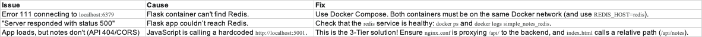

# 🧱 K8s Note App — A DevOps Journey

A simple note-taking app, built to document a real-world DevOps journey. This project evolves from a single Docker container to a full Kubernetes deployment, showcasing a practical, hands-on approach to DevOps.

-----

## 🧩 Project Overview

This app is built with a 3-tier architecture, containerized with Docker, and orchestrated locally with Docker Compose.

| Layer | Technology | Purpose |
|-------|-------------|----------|
| **Frontend** | Nginx, HTML/CSS/JS | Serves static UI & acts as a reverse proxy for the API |
| **Backend** | Flask (Python 3.9) | REST API for note operations |
| **Database** | Redis | In-memory data storage for notes |

-----

## 📁 Repository Structure

```
k8s-3tier-app/
│
├── frontend/
│   ├── dockerfile          # Nginx Dockerfile
│   ├── nginx.conf          # Nginx reverse proxy configuration
│   ├── index.html          # Static frontend UI
│   └── static/
│       └── favicon.ico
│
├── backend/
│   ├── app.py              # Flask API (pure backend)
│   ├── dockerfile          # Backend Dockerfile
│   └── requirements.txt    # Python dependencies
│
└── docker-compose.yml      # Multi-container setup (Frontend + Backend + Redis)
```

-----

## 🚀 The Journey: Milestones

### 1\. Docker Fundamentals

  * **Goal:** Containerize the Flask backend.
  * **Action:** Wrote a `Dockerfile` for the Python app, built it, and ran it locally.
  * **Result:** A portable Flask container running on `http://localhost:5001`.

### 2\. Docker Compose (2-Tier)

  * **Goal:** Connect Flask to a Redis database.
  * **Action:** Added a `docker-compose.yml` to launch and network the `app` and `redis` services.
  * **Result:** A running 2-tier application.

### 3\. 3-Tier Architecture & Reverse Proxy

  * **Goal:** Refactor to a 3-Tier app and fix external access.
  * **Problem:** Accessing the 2-Tier app via `ngrok` failed. The browser (on `https://...`) was blocked from calling the `http://localhost:5001` API (Mixed Content & CORS).
  * **Solution:**
    1.  **Frontend Service:** Created a new `frontend` service using Nginx.
    2.  **Pure API:** Stripped the Flask app into a pure, stateless API.
    3.  **Reverse Proxy:** Configured Nginx to serve the static `index.html` AND proxy all `/api/` requests to the `backend` service.
  * **Result:** A true 3-Tier system with a single entry point. The app is now perfectly accessible from the internet via `ngrok http 8080`.

-----

## 🧭 The Road Ahead

This project isn't done\! Here's the plan to make it a production-ready, cloud-native application:

  * [ ] **Infrastructure as Code (Terraform + aws):** Provision an ECR registry and EKS cluster.
  * [ ] **Kubernetes Deployment:** Deploy all three tiers to EKS using `kubectl` manifests and Helm.
  * [ ] **CI/CD Automation (GitHub Actions):** Build a pipeline to auto-build, test, and deploy on every `git push`.
  * [ ] **Monitoring:** Integrate Prometheus & Grafana to add observability.
  * [ ] **Security:** Secure the app with HTTPS Ingress and manage secrets in Kubernetes.

-----

## ⚙️ Run it Locally

1.  **Prerequisites**

      * Docker Desktop (Mac / Windows / Linux)
      * `ngrok` (optional for remote access)

2.  **Clone the Repository**

    ```bash
    git clone https://github.com/Fardeen2812/k8s-3tier-app.git
    cd k8s-3tier-app
    ```

3.  **Build and Run Containers**

    ```bash
    docker-compose up --build
    ```

    Once running, visit: **👉 `http://localhost:8080`** (The Nginx frontend)

4.  **Access From Internet (Optional)**

    ```bash
    ngrok http 8080
    ```

    Copy the `https://` forwarding URL to test on your phone or another device.

-----

## 🧰 Troubleshooting



-----

## 👨‍💻 Author

Fardeen Ali
🚀 Devops engineer
Building this project step-by-step to master real-world DevOps —
from Docker and CI/CD pipelines to cloud-native Kubernetes deployments.

## 🪪 License

This project is open source under the MIT License.

🧩 *“Don’t just build an app — build the system that builds and runs the app.”*