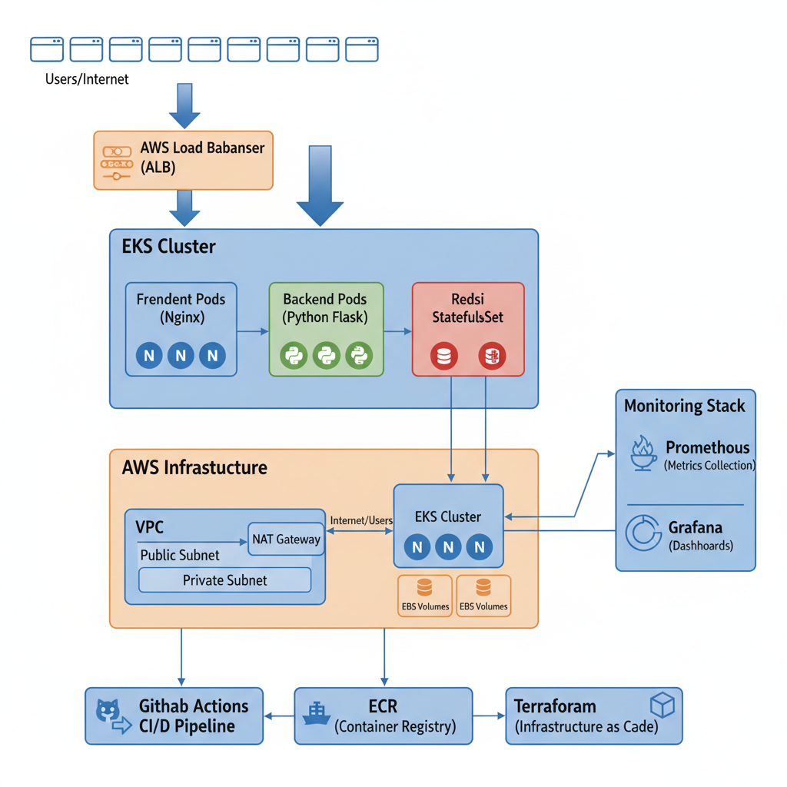
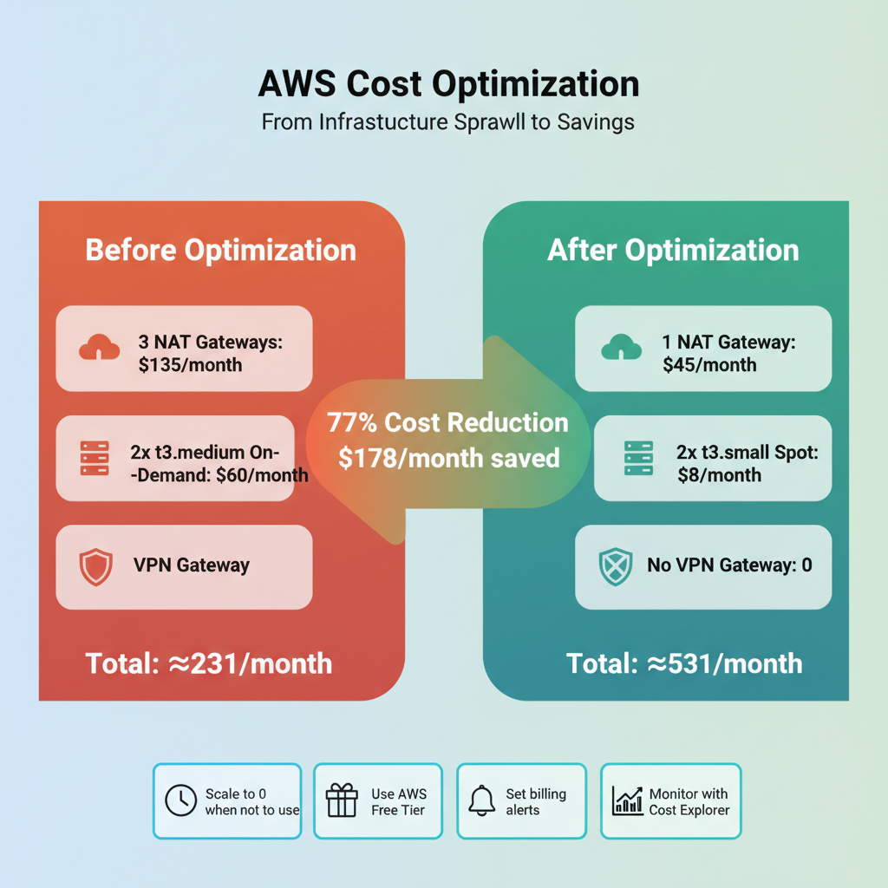
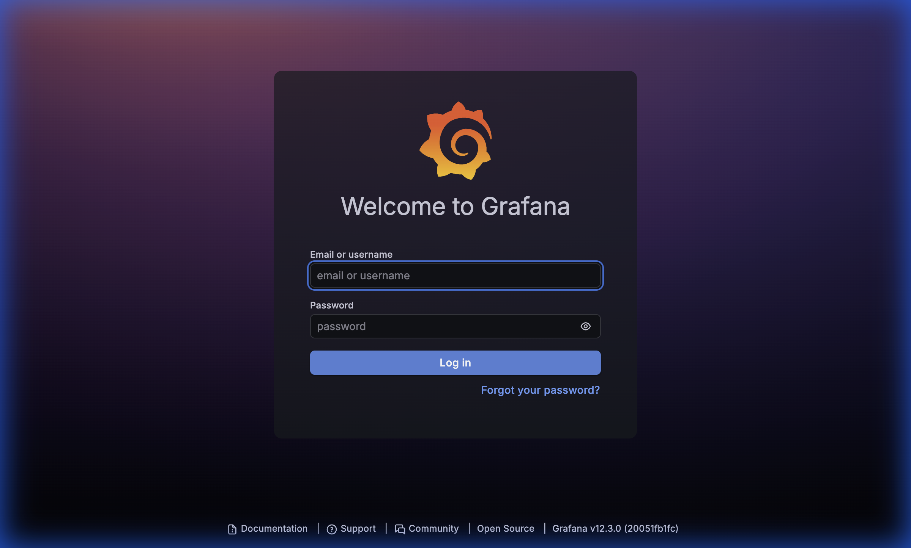
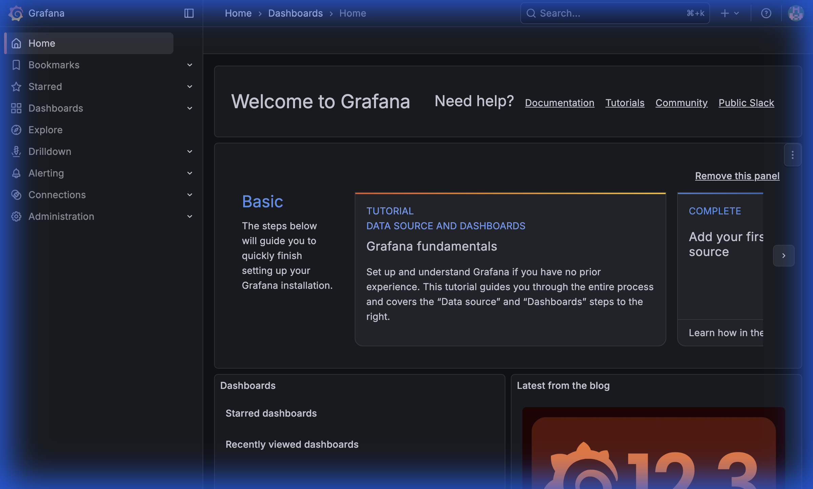
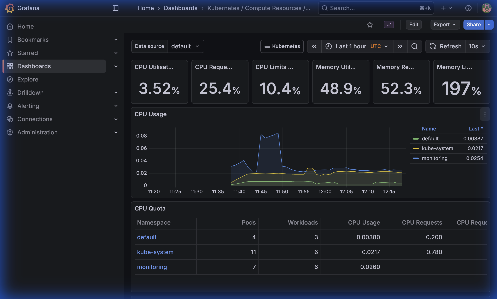

# 🚀 3-Tier Kubernetes Application on AWS EKS

A production-ready, cost-optimized 3-tier web application deployed on AWS EKS with complete monitoring and auto-scaling capabilities.



## 📋 Table of Contents
- [Overview](#overview)
- [Architecture](#architecture)
- [Features](#features)
- [Tech Stack](#tech-stack)
- [Screenshots](#screenshots)
- [Prerequisites](#prerequisites)
- [Deployment](#deployment)
- [Cost Optimization](#cost-optimization)
- [Monitoring](#monitoring)
- [Project Structure](#project-structure)

## 🗺️ DevOps Journey & Milestones

This section details the evolution of the project from a local setup to a scalable, cloud-native system.

### Phase 1: Local Development

* Containerized Flask and Redis using Docker.
* Orchestrated locally with **Docker Compose** to solve networking issues.
* Refactored to a **3-Tier Architecture** (Nginx + Flask + Redis) to resolve CORS and API routing issues.

### Phase 2: Local Kubernetes (Minikube)

* Migrated to **Minikube** using raw K8s manifests.
* Implemented **Service Discovery** so Nginx could find the Backend.
* Refactored Redis from a Deployment to a **StatefulSet** with PVCs to solve data persistence issues.

### Phase 3: Cloud Native (AWS EKS & Terraform)

* **Infrastructure as Code:** Provisioned a production-ready VPC, EKS 1.29 Cluster, and ECR repositories using Terraform modules.
* **Remote State:** Configured Terraform to use S3 and DynamoDB for secure, shared state management.
* **Multi-Arch Builds:** Built and pushed `amd64` images to ECR to ensure compatibility with AWS worker nodes.
* **Persistent Cloud Storage:** Enabled the AWS EBS CSI Driver to bind Redis PVCs to real gp2 EBS volumes.
* **Scaling:** Implemented Horizontal Pod Autoscalers (HPA) for frontend and backend service.

---

## 🎯 Overview

This project demonstrates a complete production-grade deployment of a 3-tier application on AWS EKS, featuring:
- **Frontend**: Nginx-based web interface
- **Backend**: Python Flask REST API
- **Database**: Redis for data persistence
- **Infrastructure**: Managed with Terraform
- **Monitoring**: Prometheus + Grafana stack
- **Auto-scaling**: Horizontal Pod Autoscaler (HPA)

## 🏗️ Architecture

### Application Layers
1. **Presentation Layer**: Nginx serving static frontend
2. **Application Layer**: Flask REST API handling business logic
3. **Data Layer**: Redis StatefulSet for persistent storage

### AWS Infrastructure
- **EKS Cluster**: Kubernetes 1.29
- **Node Groups**: 2x t3.small Spot instances
- **Networking**: VPC with public/private subnets, single NAT Gateway
- **Storage**: EBS CSI Driver for persistent volumes
- **Load Balancing**: AWS Application Load Balancer

### Monitoring Stack
- **Prometheus**: Metrics collection and storage
- **Grafana**: Visualization and dashboards
- **Metrics Server**: HPA metrics provider

## ✨ Features

### 🔄 Auto-Scaling
- **Horizontal Pod Autoscaler (HPA)** configured for both frontend and backend
- Scales based on CPU (70%) and Memory (80%) utilization
- Min replicas: 1, Max replicas: 5

### 💰 Cost Optimization
- **Spot Instances**: Up to 90% cost savings
- **Single NAT Gateway**: ~$60/month savings
- **Right-sized instances**: t3.small for learning workloads
- **Estimated monthly cost**: $50-70 (vs $150+ without optimizations)



### 🔐 Security & Best Practices
- Resource requests and limits on all pods
- RBAC configured for service accounts
- Network policies ready
- Secrets management via Kubernetes secrets

### 📊 Observability
- Real-time metrics via Prometheus
- Pre-built Grafana dashboards
- Pod, node, and cluster-level monitoring
- HPA scaling visualization

## 🛠️ Tech Stack

| Component | Technology |
|-----------|-----------|
| **Container Orchestration** | Kubernetes (EKS) |
| **Infrastructure as Code** | Terraform |
| **Frontend** | Nginx, HTML, CSS, JavaScript |
| **Backend** | Python, Flask |
| **Database** | Redis 7 |
| **Monitoring** | Prometheus, Grafana |
| **Container Registry** | AWS ECR |
| **Cloud Provider** | AWS |

## 📸 Screenshots

### Application Interface

*Simple Note App - Clean and responsive UI*

### Monitoring Dashboards

#### Grafana Login


#### Grafana Home


#### Kubernetes Cluster Dashboard

*Real-time cluster metrics showing CPU, memory, and pod statistics*

## 📦 Prerequisites

- AWS Account with appropriate permissions
- AWS CLI configured
- kubectl installed
- Terraform >= 1.0
- Docker
- Helm 3.x
- Git

## 🚀 Deployment

### 1. Clone the Repository
```bash
git clone https://github.com/Fardeen2812/k8s-3tier-app.git
cd k8s-3tier-app
```

### 2. Deploy Infrastructure with Terraform
```bash
cd terraform-app
terraform init
terraform plan
terraform apply
```

### 3. Configure kubectl
```bash
aws eks update-kubeconfig --name eks-cluster-K8s-3Tier-App --region us-east-1
```

### 4. Build and Push Docker Images
```bash
# Login to ECR
aws ecr get-login-password --region us-east-1 | docker login --username AWS --password-stdin <account-id>.dkr.ecr.us-east-1.amazonaws.com

# Build and push backend
docker buildx build --platform linux/amd64 -t <account-id>.dkr.ecr.us-east-1.amazonaws.com/backend-repository-k8s-3tier-app:v1 ./backend --push

# Build and push frontend
docker buildx build --platform linux/amd64 -t <account-id>.dkr.ecr.us-east-1.amazonaws.com/frontend-repository-k8s-3tier-app:v1 ./frontend --push
```

### 5. Deploy Kubernetes Resources
```bash
kubectl apply -f k8s/
```

### 6. Install Monitoring Stack
```bash
chmod +x setup-monitoring.sh
./setup-monitoring.sh
```

### 7. Verify Deployment
```bash
kubectl get all
kubectl get hpa
kubectl top nodes
kubectl top pods
```


## 💰 Cost Optimization

### Current Optimizations
1. **Spot Instances**: Configured in Terraform for up to 90% savings
2. **Single NAT Gateway**: Reduced from 3 to 1 (~$60/month savings)
3. **Right-sized Instances**: t3.small instead of t3.medium
4. **Disabled VPN Gateway**: Removed unnecessary component

### Monthly Cost Breakdown
| Component | Cost |
|-----------|------|
| EKS Control Plane | $73 |
| 2x t3.small Spot (730hrs) | ~$8 |
| NAT Gateway | $45 |
| EBS Volumes (10GB) | ~$1 |
| Load Balancers | ~$16 |
| **Total** | **~$143/month** |

### Additional Cost-Saving Tips
```bash
# Scale down when not in use
kubectl scale deployment backend-deployment --replicas=0
kubectl scale deployment frontend-deployment --replicas=0

# Or scale node group to 0
aws eks update-nodegroup-config \
  --cluster-name eks-cluster-K8s-3Tier-App \
  --nodegroup-name <nodegroup-name> \
  --scaling-config minSize=0,maxSize=3,desiredSize=0 \
  --region us-east-1
```

### Set Up Billing Alerts
1. Go to AWS Console → Billing → Budgets
2. Create alerts at $10, $25, $50 thresholds
3. Monitor with AWS Cost Explorer

## 📊 Monitoring

### Access Grafana
Get the Grafana LoadBalancer URL:
```bash
kubectl get svc -n monitoring prometheus-grafana
```

Get Grafana password:
```bash
kubectl get secret --namespace monitoring prometheus-grafana -o jsonpath='{.data.admin-password}' | base64 -d
```


### Available Dashboards
- Kubernetes / Compute Resources / Cluster
- Kubernetes / Compute Resources / Namespace (Pods)
- Kubernetes / Compute Resources / Pod
- Kubernetes / Networking / Cluster

### Key Metrics to Monitor
- Pod CPU and Memory usage
- HPA scaling events
- Node resource utilization
- Request latency
- Error rates

## 📁 Project Structure

```
3tier-app/
├── backend/
│   ├── app.py                  # Flask application
│   ├── dockerfile              # Backend container image
│   └── requirements.txt        # Python dependencies
├── frontend/
│   ├── index.html              # Web interface
│   ├── dockerfile              # Frontend container image
│   └── nginx.conf              # Nginx configuration
├── k8s/
│   ├── 1-redis-headless-service.yaml
│   ├── 2-redis-statefulset.yaml
│   ├── 3-backend-deployment.yaml
│   ├── 4-backend-service.yaml
│   ├── 5-frontend-deployment.yaml
│   ├── 6-frontend-service.yaml
│   ├── 7-backend-hpa.yaml      # Backend autoscaling
│   ├── 8-frontend-hpa.yaml     # Frontend autoscaling
│   └── 9-metrics-server-rbac-fix.yaml
├── terraform-app/
│   ├── main.tf                 # EKS cluster configuration
│   ├── variables.tf            # Terraform variables
│   ├── outputs.tf              # Terraform outputs
│   └── backend.tf              # Terraform state backend
├── screenshots/                # Application screenshots
├── setup-monitoring.sh         # Monitoring stack installer
├── PROJECT-SUMMARY.md          # Detailed project documentation
├── QUICK-REFERENCE.md          # Quick command reference
└── README.md                   # This file
```

## 🧪 Testing HPA

### Manual Load Test
```bash
# Create load generator
kubectl run load-test --image=busybox --restart=Never -- \
  /bin/sh -c "while true; do wget -q -O- http://backend-service:5001/api/data; done"

# Watch HPA scale
kubectl get hpa -w

# Monitor pods
kubectl get pods -w

# Clean up
kubectl delete pod load-test
```


## 🔧 Troubleshooting

### Common Issues

**Pods not starting**
```bash
kubectl describe pod <pod-name>
kubectl logs <pod-name>
```

**HPA showing `<unknown>`**
```bash
# Check metrics server
kubectl get pods -n kube-system | grep metrics-server
kubectl top nodes
kubectl top pods
```

**Cannot connect to cluster**
```bash
# Update kubeconfig
aws eks update-kubeconfig --name eks-cluster-K8s-3Tier-App --region us-east-1

# Verify connection
kubectl get nodes
```

## 🎓 What I Learned

- ✅ Kubernetes deployment patterns and best practices
- ✅ AWS EKS cluster management and optimization
- ✅ Infrastructure as Code with Terraform
- ✅ Container orchestration and scaling strategies
- ✅ Monitoring and observability with Prometheus/Grafana
- ✅ Cost optimization techniques for cloud infrastructure
- ✅ Docker multi-platform builds and ECR integration

## 🚀 Future Enhancements

- [ ] Implement CI/CD pipeline (GitHub Actions)
- [ ] Add Ingress Controller (AWS ALB)
- [ ] Implement ELK Stack for centralized logging
- [ ] Integrate AWS Secrets Manager
- [ ] Add Network Policies
- [ ] Implement Pod Security Policies
- [ ] Migrate Redis to AWS ElastiCache
- [ ] Add automated testing
- [ ] Implement service mesh (Istio)
- [ ] Add custom Prometheus metrics

## 📝 License

This project is licensed under the MIT License - see the LICENSE file for details.

## 🤝 Contributing

Contributions are welcome! Please feel free to submit a Pull Request.

## 📧 Contact

- **Author**: Fardeen Ali
- **GitHub**: [@Fardeen2812](https://github.com/Fardeen2812)
- **Project Link**: [https://github.com/Fardeen2812/k8s-3tier-app](https://github.com/Fardeen2812/k8s-3tier-app)

## 🙏 Acknowledgments

- AWS EKS Documentation
- Kubernetes Official Documentation
- Terraform AWS Provider Documentation
- Prometheus & Grafana Communities

---

**⭐ If you found this project helpful, please consider giving it a star!**

**📊 Current Status**: ✅ Production Ready | 💰 Cost Optimized | 📈 Auto-Scaling Enabled | 📊 Monitoring Active